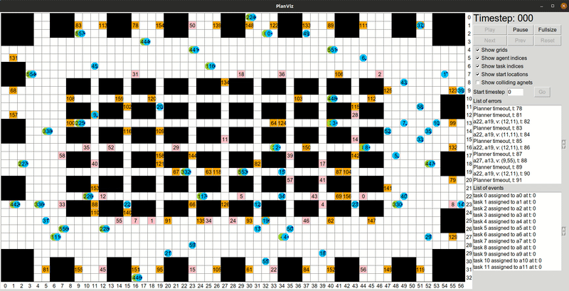

# PlanViz
Welcome to PlanViz! This is an **offline** visualization tool for analysing solutions to multi-robot and multi-agent coordination problems.
It is developed as a support tool for participants in the [League of Robot Runners](http://leagueofrobotrunners.org) competition.
However, PlanViz can also be used for a variety of similar problems which are outside the scope of the competition. 

The primary purpose of PlanViz is to better understand how robots/agents move across the map and to offer insights into the errors and events given by the competition [Start-Kit](https://github.com/MAPF-Competition/Start-Kit). Being an offline tool, PlanViz takes as input a grid map and a log file (in `JSON` format) produced by the the competition Start-Kit. The log file describes the planned and executed actions of agents at each timestep and renders the result with [`tkinter`](https://docs.python.org/3/library/tkinter.html), a pyton interface for the Tcl/Tk GUI toolkit (see the `example/warehouse-small.map` and `example/warehouse-small-60.json` for example). An example of the application in action is shown in the following video.




## Run
Please refer to the [PlanViz instruction manual](./PlanViz.md) for details about how to use this tool and supported features. The following simple example shows how to visualise a plan file, from the JSON formatted descriptions produced by the Robot Runners start-kit.

Open a terminal and type the following command:
```bash
python3 plan_viz.py --map ../example/warehouse_small.map --plan ../example/warehouse_small.json --grid --aid --static --ca
```

# Tracker Transfer
Tracker Transfer is a tool that helps to convert best-known solutions to a wide range of MAPF problems, as published by the community website [MAPF tracker](http://tracker.pathfinding.ai/). Once converted, these plans can be visualised with PlanViz. 


## Run
Please refer to the [Tracker Transfer instruction manual](./Tracker%20Transfer.md) for details about how to use this tool and supported features. The following examples shows how to use Tracker Transfer to convert a single and multiple plans from the CSV formatted output of the MAPF Tracker to the format of PlanViz:

To convert a single plan, open a terminal and type the following command:
```bash
python3 tracker_transfer.py --plan ../example/random-32-32-20_random_1_300.csv --scen ../example/random-32-32-20-random-1.scen --outputFile ../example/transfer_result
```
The MAPF Tracker also supports exporting multiple plans into a single csv file at the same time (see http://tracker.pathfinding.ai/results/). Tracker transfer supports this format, please refer to the documentation for more details.
